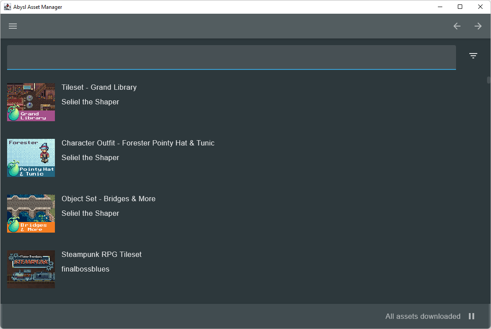

# Abysl Asset Manager

Abysl Asset Manager is an easy to use library management tool to index and search game assets.

## Features

* Itch.IO Library Import
* HumbleBundle.com Library Import
* Auto extract zip files on import
* Fast fuzzy search across large libraries (e.g. sword.png or goblin.jpg)
* Filter by file type
* Play Audio/Show asset images in-app to find the asset you're looking for

## Roadmap
* Collections/Categorization features: Easily organize assets into groups for specific games or assets that work well together.
* IPFS Snapshots - Take a snapshot of a collection and get an ipfs hash which you can use in your code to create a read-only Virtual File System inside of your game and optionally have your users help distribute assets for your game via IPFS. The advantage of this approach is that you can easily version control your assets by simply updating a hash inside of your git repository and commiting rather than having a lot of binary assets inside of it.
* Tagging Support - Create custom tags for assets for improved searchability, possibly a distributed tagging system via IPFS where you can see other people's tags for the same assets.

## Usage
* In order to import assets, go to the menu dropdown button at the top left of the screen, click import assets, then select from the dropdown which platform you wish to import from.
* For humble bundle you need to copy your library json from the network request made on the webpage. [Here](https://www.youtube.com/watch?v=BojZ0AIBfc8) is a quick video showing how to do it with chrome (should be pretty easy, let me know if you have problems!)
* For itch.io you need to get an API key for your account which you can do from [here](https://itch.io/user/settings/api-keys)

## Installation

Simply download one of the binaries from the [releases page](https://github.com/abysl/AssetManager/releases)